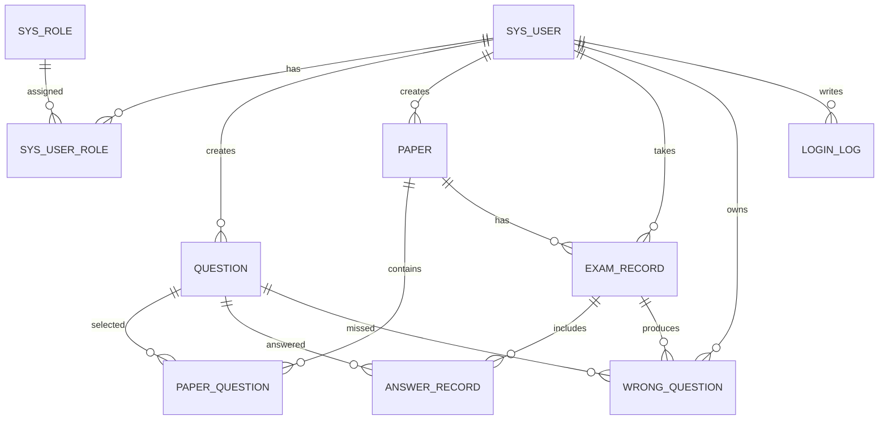

# ER 图文字说明与表关系

## 实体

1. 用户 sys_user：保存登录账号、邮箱、真实姓名、状态等信息。
2. 角色 sys_role：保存 ADMIN、TEACHER、STUDENT 等角色信息。
3. 题目 question：保存题型、题干、选项、正确答案、解析、难度和知识点。
4. 试卷 paper：保存试卷名称、考试时长、总分、及格分、考试时间和发布状态。
5. 考试记录 exam_record：保存学生参加某张试卷的开始时间、提交时间、得分和状态。
6. 答题记录 answer_record：保存每次考试中每道题的学生答案、正确答案快照和得分。
7. 错题 wrong_question：保存学生答错的题目、学生答案和正确答案。
8. 登录日志 login_log：保存用户登录成功或失败的审计记录。

## 关系说明

1. sys_user 与 sys_role 是多对多关系，通过 sys_user_role 实现。
2. sys_user 与 question 是一对多关系，一个教师可以创建多个题目。
3. sys_user 与 paper 是一对多关系，一个教师可以创建多张试卷。
4. paper 与 question 是多对多关系，通过 paper_question 实现。
5. sys_user 与 exam_record 是一对多关系，一个学生可以有多条考试记录。
6. paper 与 exam_record 是一对多关系，一张试卷可以被多个学生参加。
7. exam_record 与 answer_record 是一对多关系，一次考试包含多条答题记录。
8. sys_user 与 wrong_question 是一对多关系，一个学生可以有多条错题记录。
9. question 与 wrong_question 是一对多关系，一道题可以被多个学生答错。
10. exam_record 与 wrong_question 是一对多关系，一次考试可以产生多条错题记录。
11. sys_user 与 login_log 是一对多关系，登录失败时 login_log.user_id 可以为空。

## Mermaid ER 图草稿

## 关键约束

1. sys_user.username 唯一，防止用户名重复。
2. sys_user.email 唯一，防止邮箱重复。
3. sys_role.role_code 唯一，保证角色编码稳定。
4. sys_user_role(user_id, role_id) 唯一，防止重复绑定角色。
5. paper_question(paper_id, question_id) 唯一，防止同一试卷重复加入同一题目。
6. exam_record(student_id, paper_id) 唯一，限制一名学生对同一张试卷只生成一条考试记录。
7. answer_record(exam_id, question_id) 唯一，防止同一次考试重复保存同一道题答案。

